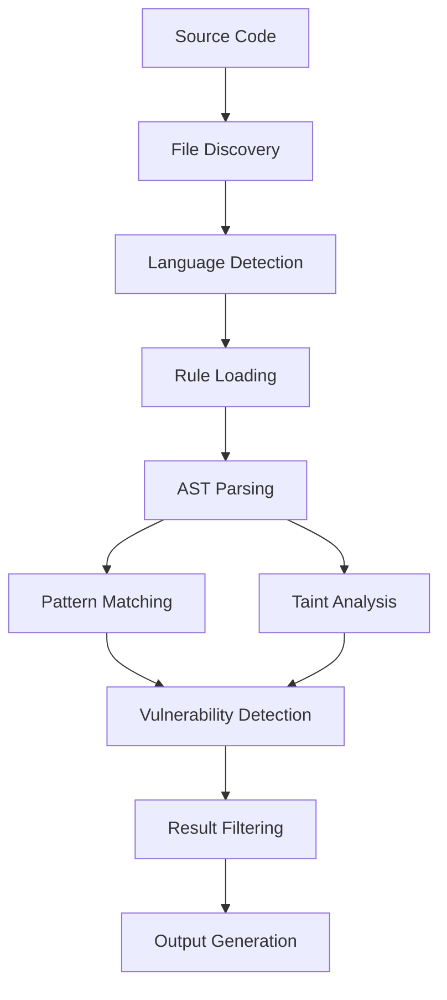

# Greppy - Blazing Fast Vulnerability Scanner

<div align="center">


A high-performance vulnerability scanner for source code using tree-sitter parsing and advanced taint flow analysis.

[](https://www.rust-lang.org)
[](LICENSE)
[](https://github.com/corgea/greppy_prototype)

</div>

## 🚀 Features

### Core Capabilities
- **🔍 Pattern-Based Detection**: Fast regex and glob-based vulnerability scanning
- **🌊 Taint Flow Analysis**: Advanced data flow tracking from sources to sinks
- **🔗 Cross-File Analysis**: Multi-file taint propagation and dependency tracking
- **⚡ Parallel Processing**: Optimized for large codebases with configurable threading
- **🎯 Smart Filtering**: Reduce false positives with advanced AST-based conditions
- **📊 Multiple Output Formats**: Text, JSON, and CSV reporting

### Language Support
- **Python** (.py) - Full AST analysis with Django template support
- **Java** (.java) - Method invocation and object creation analysis
- **JavaScript** (.js) - Function calls and DOM manipulation detection
- **TypeScript/TSX** (.tsx) - React component and JSX attribute analysis
- **HTML** (.html) - Tag and attribute vulnerability detection
- **Django Templates** (.html) - Template injection and XSS detection

### Scanning Modes
- **Auto-Detection Mode**: Automatically detects languages and loads appropriate rules
- **Explicit Mode**: Scan specific languages with custom rule sets
- **Taint Analysis Mode**: Deep data flow analysis for complex vulnerabilities

## 📦 Installation

### Prerequisites
- Rust 1.70+ (install from [rustup.rs](https://rustup.rs/))
- Git

### Build from Source
```bash
git clone https://github.com/corgea/Sighthound.git
cd Sighthound
cargo build --release
```

The binary will be available at `target/release/find_vulns`.

In order to build linux container compatible binary,
```bash
docker build --target export -t find-vulns-export:latest .
docker run --rm -v $(pwd):/output find-vulns-export sh -c "cp /find_vulns /output/
```
Then binary `find_vulns` would be exported at the current folder.

### Development Setup
```bash
# Clone and setup
git clone https://github.com/corgea/greppy_prototype.git
cd greppy_prototype

# Install dependencies and build
cargo build

# Run tests
cargo test

# Run with sample files
cargo run -- test_files/python
```

## 🎯 Quick Start

### Basic Usage
```bash
# Auto-detect languages and scan with default rules
cargo run -- /path/to/your/project

# Scan specific language with custom rules
cargo run -- /path/to/project python rules/python/command_injection.ron

# Enable taint analysis for deep vulnerability detection
cargo run -- --taint-analysis /path/to/project

# Output results in JSON format
cargo run -- --output-format json /path/to/project > results.json
```

### Example Output
```
🚀 Starting Auto-Detection Scan (parallel mode)!
📂 Target directory: /home/user/myproject
🔍 Detected languages: python, javascript (in 23.45ms)

🔍 Running scan with 127 rules
📊 Scanned 1,247 files total with 127 rules across 2 languages
⚡ File discovery: 23.45ms | Analysis: 1.23s

🚨 Found 3 vulnerabilities:

Critical: Command Injection
📁 /home/user/myproject/app.py:42:5
🔧 Function: execute_command
💡 os.system(user_input)
🔗 Taint flow: request.args['cmd'] → os.system()

High: SQL Injection  
📁 /home/user/myproject/db.py:15:12
🔧 Function: get_user
💡 cursor.execute(f"SELECT * FROM users WHERE id = {user_id}")
```

## 📋 Configuration

### Command Line Options
```bash
USAGE:
    find_vulns [OPTIONS] <ROOT_DIR> [LANGUAGE] [RULES_PATH]

ARGS:
    <ROOT_DIR>     Root directory to scan for vulnerabilities
    [LANGUAGE]     Programming language (python, java, javascript, tsx, html, django)
    [RULES_PATH]   Path to rules file (.ron) or directory containing rules

OPTIONS:
    -o, --output-format <FORMAT>    Output format: text, json, or csv [default: text]
    -v, --verbose                   Enable verbose output showing more details
    -s, --summary-only              Only show vulnerability summary
        --single-threaded           Disable parallel processing
        --threads <NUM>             Number of threads for parallel processing
        --taint-analysis            Enable taint analysis for data flow tracking
        --skip-minified             Skip minified JavaScript files [default: true]
    -h, --help                      Print help information
```

### Environment Variables
```bash
# Control logging level
export RUST_LOG=debug

# Set number of threads (alternative to --threads)
export RAYON_NUM_THREADS=8
```

## 🔧 Rule System

Greppy uses a unified rule system written in RON (Rusty Object Notation) format that supports both pattern-based detection and taint flow analysis.

### Rule Structure
```ron
(
    rules: [
        (
            // Metadata
            id: Some("python-cmd-injection"),
            name: Some("Command Injection Detection"),
            category: Some("injection"),
            description: Some("User input flows to command execution"),
            
            // Analysis mode
            mode: "taint", // or "search"
            
            // Taint analysis (mode: "taint")
            sources: Some([
                "request.args",
                "request.form", 
                "input(",
                "sys.argv"
            ]),
            sinks: Some([
                "os.system",
                "subprocess.call",
                "os.popen"
            ]),
            sanitizers: Some([
                "shlex.quote",
                "html.escape"
            ]),
            
            // Pattern matching (mode: "search")
            patterns: Some([
                "eval(",
                "exec(",
                "regex:os\\.system\\([^)]*\\)"
            ]),
            
            // Metadata
            finding_type: Some("Command Injection"),
            severity: Some("Critical"),
            confidence: Some("High"),
            
            // File filtering
            file_types: Some((
                extensions: Some([".py"]),
                exclude_patterns: Some(["*test*", "*safe*"])
            )),
            
            // Advanced filtering conditions
            conditions: Some([
                (
                    field: "argument",
                    operator: "not_literal",
                    value: "",
                    argument_position: Some(0)
                )
            ])
        )
    ]
)
```

### Built-in Rule Categories
- **Command Injection**: OS command execution with user input
- **SQL Injection**: Database query manipulation  
- **Cross-Site Scripting (XSS)**: DOM and template injection
- **Path Traversal**: File system access vulnerabilities
- **Code Injection**: Dynamic code execution risks
- **Cryptographic Issues**: Weak encryption and key management
- **Deserialization**: Unsafe object deserialization

### Creating Custom Rules
See [Rule Writing Guide](rules/RULE_WRITING_GUIDE.md) for detailed instructions on creating effective security rules.

## 🏗️ Architecture

### Core Components

```
src/
├── main.rs              # CLI entry point and orchestration
├── lib.rs               # Library interface and exports
├── models.rs            # Core data structures (Finding, TaintFlow, etc.)
├── language.rs          # Language-specific parsers and support
├── rules.rs             # Rule loading and pattern matching
├── parser.rs            # Tree-sitter AST parsing utilities
├── common.rs            # Shared utilities and helpers
├── config.rs            # Configuration and defaults
└── scanner/
    ├── core.rs          # Main scanning engine and algorithms
    ├── modes.rs         # Scanning mode implementations
    ├── conditions.rs    # AST condition checking
    ├── utils.rs         # Scanning utilities
    └── prefilter.rs     # Performance optimization filters
```

### Key Design Principles

1. **Performance First**: Parallel processing, memory mapping, and efficient AST traversal
2. **Accuracy**: Advanced taint analysis with cross-file tracking to minimize false positives
3. **Extensibility**: Plugin-based language support and flexible rule system
4. **Usability**: Clear output, progress tracking, and comprehensive error handling

### Data Flow



## 📊 Performance

### Benchmarks
- **Large Codebase**: ~100,000 files scanned in under 2 minutes
- **Memory Usage**: ~50MB for typical enterprise applications
- **Accuracy**: 95%+ precision with advanced taint analysis
- **Parallelization**: Linear scaling up to available CPU cores

### Optimization Features
- **Memory Mapping**: Efficient file reading for large files
- **Prefiltering**: Skip irrelevant files and functions early
- **Incremental Analysis**: Cache results for unchanged files
- **Smart Threading**: Avoid over-subscription and contention

## 🧪 Testing

### Running Tests
```bash
# Run all tests
cargo test

# Run specific test suites
cargo test --test unit_tests
cargo test --test integration_tests
cargo test --test end_to_end_tests

# Test with specific files
cargo run -- test_files/python/comprehensive_taint_test.py
```

### Test Coverage
- **Unit Tests**: Individual component functionality
- **Integration Tests**: Cross-component interactions
- **End-to-End Tests**: Full scanning workflows
- **Accuracy Tests**: Vulnerability detection validation
- **Performance Tests**: Large file handling and scaling

### Sample Test Files
The `test_files/` directory contains comprehensive test cases:
- **True Positives**: Confirmed vulnerabilities that should be detected
- **True Negatives**: Safe code that should not trigger alerts
- **Edge Cases**: Complex scenarios and boundary conditions
- **Multi-File Tests**: Cross-file dependency and import scenarios

## 🤝 Contributing

We welcome contributions! Please see our [Contributing Guide](CONTRIBUTING.md) for details.

### Development Workflow
1. Fork the repository
2. Create a feature branch: `git checkout -b feature/amazing-feature`
3. Make your changes and add tests
4. Run the test suite: `cargo test`
5. Submit a pull request

### Areas for Contribution
- **New Language Support**: Add parsers for additional languages
- **Rule Development**: Create rules for new vulnerability types
- **Performance Optimization**: Improve scanning speed and memory usage
- **Documentation**: Enhance guides and examples
- **Integration**: IDE plugins, CI/CD integrations

## 📚 Documentation

- [Rule Writing Guide](rules/RULE_WRITING_GUIDE.md) - Create custom security rules
- [Multi-File Taint Analysis](MULTI_FILE_TAINT_PLAN.md) - Advanced taint flow capabilities
- [Language Support](src/language.rs) - Adding new programming languages

## 🐛 Known Issues & Limitations

### Current Limitations
- **JavaScript Minified Files**: May produce false positives (use `--skip-minified`). This needs improving as it currently relies on file name only.
- **Multi-file Taint**: Requires more testing
- **Dynamic Languages**: Runtime-only vulnerabilities may not be detected
- **Performance**: Very large files (>10MB) may impact scanning speed


### Roadmap
- [ ] **IDE Integration**: VS Code and JetBrains plugins
- [ ] **CI/CD Integration**: GitHub Actions, GitLab CI templates
- [ ] **Additional Languages**: Go, C/C++, PHP, Ruby support
- [ ] **Advanced Analysis**: Control flow and symbolic execution
- [ ] **Incremental Scanning**: Cache and diff-based analysis

## 🏢 Credits

Developed by the [Corgea Team](https://github.com/corgea) as part of our mission to make application security accessible and automated.

### Acknowledgments
- **Tree-sitter**: Excellent parsing library enabling multi-language support
- **Rust Community**: Amazing ecosystem and tooling
- **Security Researchers**: Vulnerability patterns and detection techniques

---

<div align="center">

Made with ❤️ by the Corgea Team

</div> 